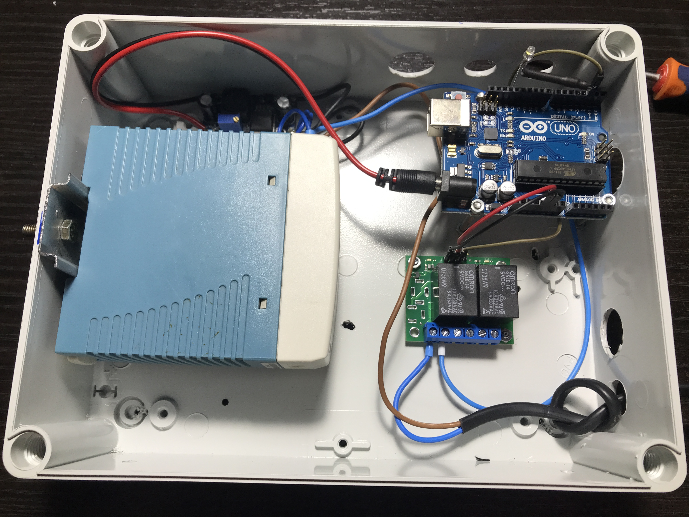

# DIY-flower-self-watering

This project is made as a home automation task.

The goal of this project is to keep plants consistently watered even during times when no one is home.

At the moment the project could be considered at a crude state. The Arduino board opens a electric valve at regular intervals for a specific ammount of time. (since its winter at the time of writing this, 5 seconds of a water stream at a 3 day interval)

As a future improvement, the plan is to connect the Arduino board to a temperature & humidity sensor to alter watering parameters and also to add a soil humidity sensor to further adjust those parameters. 

Visit the [/Arduino Code/Udat_flori_v0.2.ino](https://github.com/poweredby2dor/DIY-flower-self-watering/blob/master/Arduino%20Code/Udat_flori_v0.2.ino "/Arduino Code/Udat_flori_v0.2.ino") file to see the code written and loaded into the project.

Visit the [/Photos](https://github.com/poweredby2dor/DIY-flower-self-watering/tree/master/Photos "/Photos") folder to see a picture timeline of the project.
